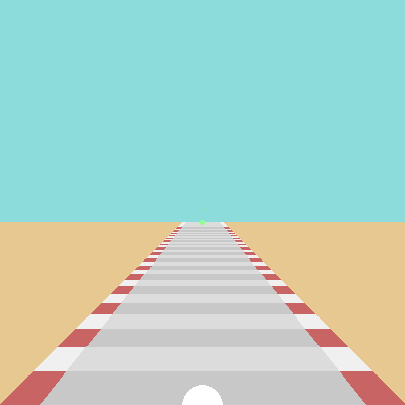

<p align="center"></p>

<h4 align="center">A SNES-styled Racing Game Foundation</p>

[]()

---

---

## Purpose

This project is a side-effort to build a SNES-styled racing *engine* using [SDL2](https://www.libsdl.org/download-2.0.php) and C++17. Right now there is no specific game I want to really design with this foundation, I just really enjoy the process of building basic engine architecture. However, once the foundation is set, I will probably begin to plan specifics of the kind of game I would like to build with this codebase. That means things aren't too visually impressive for the time being, and probably won't be for a decent bit longer - as you can see below. **:s**

<p align="center"></p>

At the time or writing, this project is under heavy restructuring and development. I have just done a mass refactoring of the codebase and am now designing with the intentions of building a firm foundation first and foremost - wow that was some good alliteration, right? 

If you are intending to branch, clone, or repurpose this project please [contact me](rilliden@gmail.com) and I will start working on branches instead of developing directly on the master.

It should be noted that, at this time, this project is **limited to the Windows OS**, and targeting Windows 10, due to the current version of my [*Windows Console Text Colorizer*](https://github.com/WerenskjoldH/Windows-Font-Colorizer) header-only "library" is not being developed with varying operating systems in mind. This is something I intend to address very soon - it's not a hard change, I just have a lot of other things I'm working on in parallel right now and that's not at the top of the list.

---

## Development

<h3 align="center">Development: Ongoing</h3>

Right this second, it is the second day of writing this engine. That is, completely rebuilding it from the weekend project it once was into more of an actual foundation for a game to be built on. This approach means there will be far less visual appeal in these early stages. *Hence the basic ole gif up above. **:(***

But this does also mean that the code building up the project will get far more clean as time goes on instead of building into a rats nest of unrefactored and uncommented **sludge**. Instead, in each iteration I intend to target a specific feature or indiviual system and improve/refactor with intentions to not side-track into *"Well if..." territory*.

Now all that said, this repo is a very tertiary project that I will only be updating when I need to take a break from tasks at hand or just get back to what I enjoy about programming in the first place.

If you are curious of what's to come, check out the "To-do:"s at the top of of my header files! I don't want to risk writing everything here and forgetting to keep it updated as time passes :s I see that a lot and it always bothers me. 

---

## Setup

1. Clone this repository
2. Link the proper [SDL2](https://www.libsdl.org/download-2.0.php) API binaries
3. Build the project, and ensure *SDL2.dll* is in the same directory as the executable
---

## Acknowledgements

* Jake Gordon's [fantastic article](https://codeincomplete.com/articles/javascript-racer/) on creating an old-school pseudo-3d racing game in Javascript. My stumbling onto that article led me to starting the original version of this project in 2019.
* Eric Lengyel, for his book titled *Mathematics for 3D Game Programming and Computer Graphics*. That book is just an all around fantastic reference, very concise and great in a pinch!

---

## Support

If you are looking for support please send a non-spammy looking email to Rilliden@gmail.com. If you are unsure what to write for the title, try something in this format:

```
[Repository Name] <Question>
```

---

## Q&A

### _Q_: I'm running (Linux/Mac OS/Anything other than windows), will this run? 

**A**: Probably not, I'm sorry, I will get around to fixing this I pretty promise! However, as I put above, my [*Windows Console Text Colorizer*](https://github.com/WerenskjoldH/Windows-Font-Colorizer) header-only "library" is not being developed with varying operating systems in mind. This inclusion makes this project - as of right now - only targetting Windows OSs (particularly Windows 10). That said, I don't know what would happen if you did run it on a non-Windows OS. If you really want, porting this project is quite simple if you alter the *consoleColorizer.h* file or just purge it from the project all together. 

### _Q_: It's been a while since you commited anything, what's up?

**A**: I'm likely working on something that I deemed more of a focus, that doesn't mean I'm done with this project though. I have returned to projects over a year after I last worked on them before, so you can never quite know if I abandoned something.